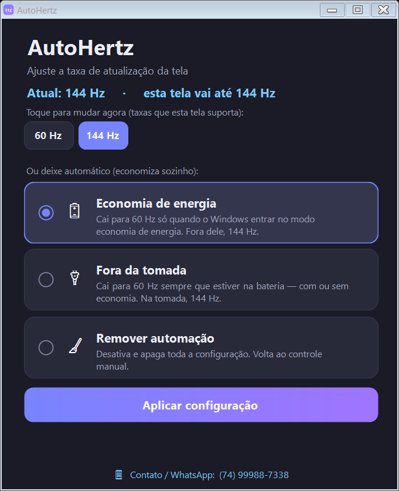

# ⚡ AutoHertz

**Faça a bateria do seu notebook durar mais — sem abrir mão de uma tela lisa e fluida.**

O AutoHertz ajusta sozinho a "velocidade" da sua tela (os famosos **Hz**) para economizar bateria quando você está na bateria, e voltar ao máximo de fluidez quando está na tomada. Você configura uma vez e **esquece**. 🔋

  

  <a href="https://github.com/M4tiass/AutoHertz/raw/main/AutoHertz.exe"><b>⬇️ BAIXAR O AUTOHERTZ</b></a>

É **um arquivo só** (~53 KB). Baixou? É só **clicar duas vezes**. Não precisa instalar nada. 😉

---

## 🤔 O que é "Hz" (e por que isso mexe na sua bateria)?

Toda tela tem uma **taxa de atualização**, medida em **Hz**. É o quão "lisa" a imagem fica quando você mexe o mouse, rola uma página ou joga:

- **Mais Hz** (120, 144, 165…) = movimento **mais suave e gostoso de ver**… mas **gasta mais bateria**. 🔴
- **60 Hz** = mais que suficiente pro dia a dia e **economiza bateria**. 🟢

O problema: a maioria dos notebooks fica no Hz máximo **o tempo todo** — inclusive na bateria, gastando energia à toa. **O AutoHertz resolve isso automaticamente.**

## ✅ O que você ganha

- 🔋 **Bateria durando mais** — fora da tomada, a tela cai pra 60 Hz e consome menos.
- ⚡ **O melhor dos dois mundos** — tela fluida na tomada (ótimo pra jogos e rolagem), econômica na bateria.
- 🤖 **Automático** — configura uma vez e pronto. Ele troca sozinho quando você tira ou põe o carregador.
- 👆 **Ou na hora, num clique** — quer mudar você mesmo? Tem botões com todas as taxas da sua tela.
- 🪶 **Leve e seguro** — não pesa no PC, **não pede senha de administrador**, **não usa internet** e **não coleta nada**. O código é aberto.
- 🆓 **Grátis** e funciona em **qualquer notebook** — ele detecta a sua tela sozinho (60, 75, 90, 144, 165, 240 Hz…).

## 🚀 Como usar (bem simples)

1. **[Baixe o AutoHertz.exe](https://github.com/M4tiass/AutoHertz/raw/main/AutoHertz.exe)**.
2. Clique **duas vezes** para abrir.
3. Escolha o que preferir:
   - 🔋 **Economia de energia** — cai pra 60 Hz só quando o Windows entra no modo de economia.
   - 🔌 **Fora da tomada** — cai pra 60 Hz sempre que você tira o carregador.
   - 👆 **Na hora** — clique numa das taxas (ex.: `60 Hz` / `144 Hz`) e muda na mesma hora.

Prontinho! Ele passa a cuidar de tudo sozinho e **liga junto com o Windows**, rodando escondido (sem janela nem barulho).

Mudou de ideia? Abra de novo e escolha 🧹 **Remover automação** — ele desfaz tudo e volta ao normal.

## ⚠️ Apareceu um aviso do Windows ao abrir? (é normal, pode ficar tranquilo)

Ao abrir, o Windows pode mostrar uma tela azul/amarela: **"O Windows protegeu o computador"**, com **"Fornecedor desconhecido"**.

**Isso é normal e o app é seguro.** Esse aviso (chamado *SmartScreen*) aparece para **qualquer** programa novo, pequeno e gratuito baixado da internet, que não tem um certificado pago (que custa caro e não faz sentido pra um app de graça). Ele **não** diz que o app é perigoso — só que ainda é novo e a Microsoft não o "conhece".

Para abrir mesmo assim:

1. Clique em **"Mais informações"**.
2. Clique em **"Executar assim mesmo"**.

Pronto — **só aparece na primeira vez**. Depois abre normalmente. E, se quiser conferir, o **código-fonte está todo aqui** (pasta [`src`](src)): nada é escondido.

## 🛠️ Como funciona (pra quem é curioso)

- Feito em **C# (WinForms)** e compilado com uma ferramenta que **já vem no Windows** — por isso é tão pequeno e não depende de nada.
- Ele fica de olho nos avisos de energia do Windows (tirou/pôs o cabo, entrou em economia) e ajusta a taxa da tela na hora certa.
- Inicia junto com o Windows pela sua conta de usuário — **sem precisar de administrador**.
- Todo o código está na pasta **[`src`](src)**, com um `build.bat` pra recompilar.

## 💬 Contato

Ficou com dúvida ou quer sugerir algo? Chama! 
**WhatsApp: [(74) 99988-7338](https://wa.me/5574999887338)**

## 📄 Licença

**MIT** — pode usar, compartilhar e modificar à vontade.
